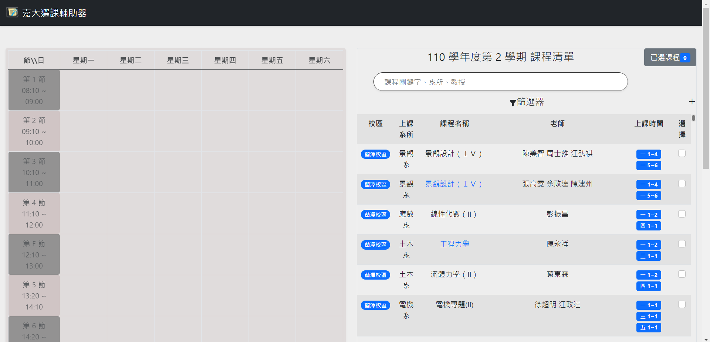
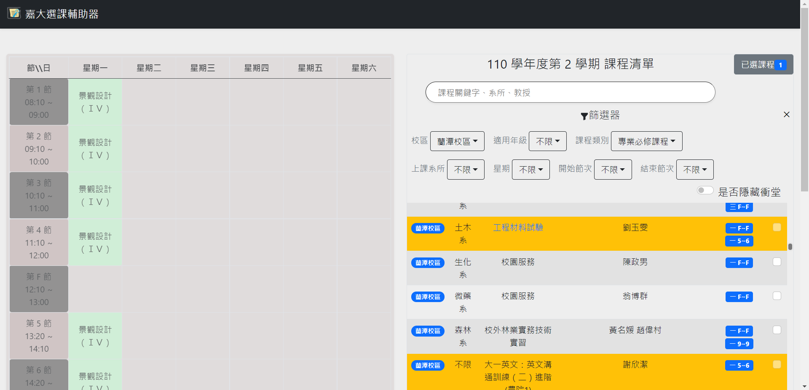
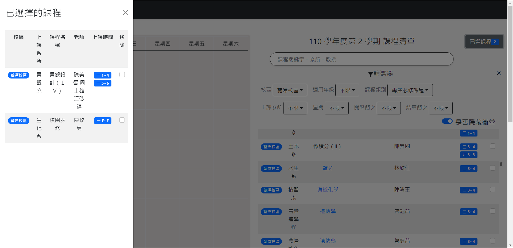

# [嘉大選課輔助器](https://tony11306.github.io/Chiayi-university-course-selection-support/)

## 特點

一個使用 react 框架製作的網頁，前端開發耗時約略 1 個禮拜，相比於原本的選課系統，多出了以下功能

- 衝堂課程鎖定
- 課表圖表化預覽
- 更簡潔現代的畫面
- 更方便的搜尋
- 動態更新畫面

部分 CSS 取自於以前的專案 [嘉義大學課表產生器](https://tony11306.github.io/Chiayi-university-curriculum-generator/)

## 畫面
### 初始預覽畫面

### 衝堂鎖定、課表預覽、篩選功能

### 新增刪除
